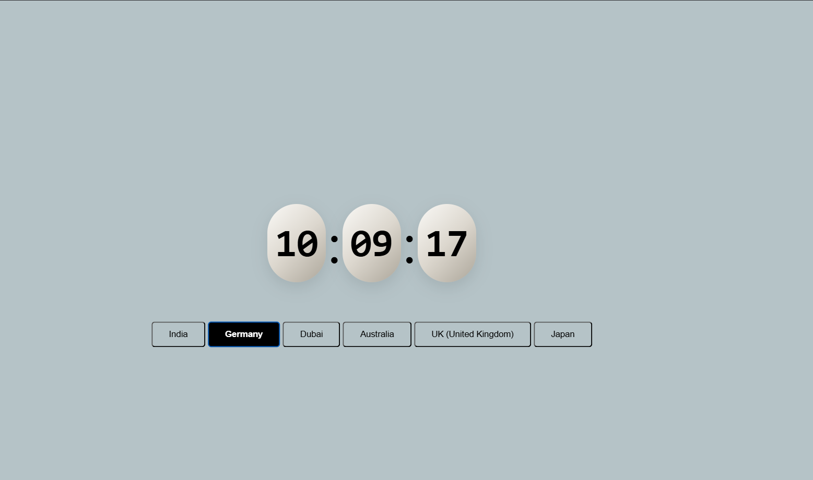

# #🕒 World Clock


World Clock Web App A sleek and interactive World Clock built using HTML, CSS, and JavaScript. Select any country to view its current time in real-time with a responsive and modern UI.

## 🔗 Live Demo

(https://clock-35f3e.web.app/)

## 📸 Preview



## 🛠 Features

- Real-time digital clock

- Select any country to view its local time

- Auto-updates every second

- Clean and modern UI

- Fully responsive across devices

🌍 Country Time Support
Choose button of countries, and the clock automatically updates to show the correct time in that region based on timezone offsets.

## 📂 Tech Stack

- HTML5

- CSS3

- JavaScript

- Firebase Hosting

## 🚀 Getting Started

To run this project locally:

```bash
# Clone the repository
git clone https://github.com/Mayank-301/clock.git

# Navigate to the project directory
cd clock

# Open index.html in your browser
